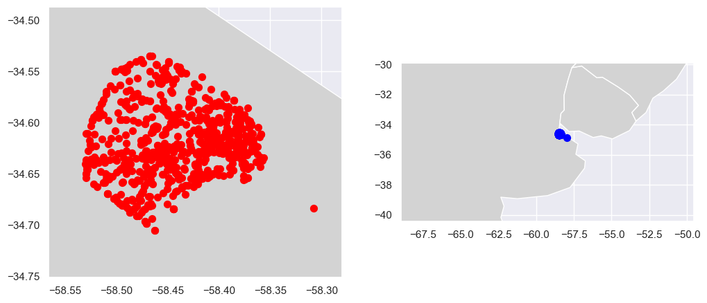
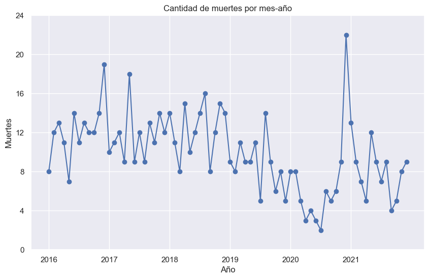
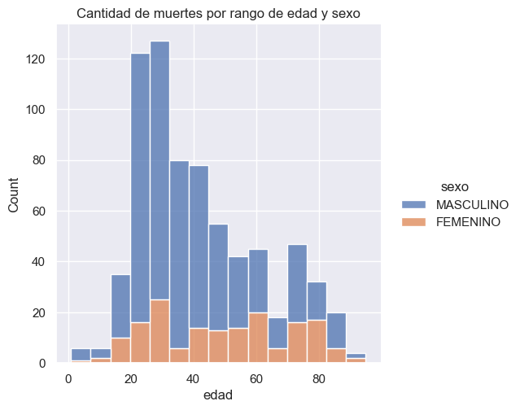
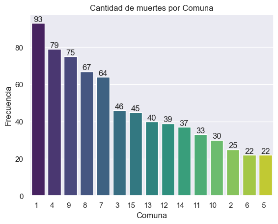
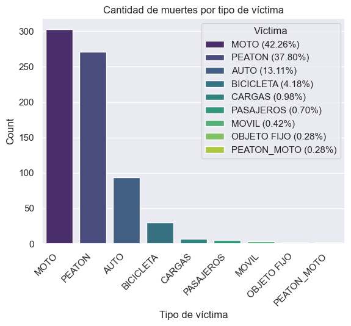

## P2_DataAnalytics
# Proyecto de Análisis de Siniestros Viales en CABA con Víctimas Fatales (2016-2021)
*Por Diego Gamarra Rivera*

## Presentación del Proyecto 

Este proyecto representa un análisis de datos llevado a cabo por un Data Analyst en simulación de un encargo del Observatorio de Movilidad y Seguridad Vial (OMSV) bajo la Secretaría de Transporte del Gobierno de la Ciudad Autónoma de Buenos Aires (CABA). El objetivo principal es proporcionar información relevante para la toma de decisiones orientada a la prevención y reducción de siniestros viales con víctimas fatales en la ciudad.
Los datos utilizados se extraen del dataset oficial de víctimas de siniestros viales en CABA entre 2016 y 2021, accesible en la página oficial de la ciudad. [Datos Oficiales](https://data.buenosaires.gob.ar/dataset/victimas-siniestros-viales)

## Contexto del Problema 

Los siniestros viales, también conocidos como accidentes de tráfico, involucran diversos vehículos y pueden resultar en daños materiales, lesiones graves o fatales. En Argentina, aproximadamente 4,000 personas mueren cada año en siniestros viales, siendo una de las principales causas de muertes violentas.

La ciudad de Buenos Aires, con su alta densidad poblacional y tráfico, enfrenta desafíos particulares en materia de seguridad vial. El análisis de la evolución temporal, lugares críticos, perfiles de víctimas y factores contribuyentes es esencial para desarrollar estrategias efectivas.

## Desarrollo del Proyecto 

### Datos Utilizados 

Para este análisis, se trabajó con un dataset que contiene información detallada sobre los siniestros viales y las víctimas involucradas. Se realizó un proceso de ETL (Extracción, Transformación y Carga) para limpiar y estructurar los datos, eliminando nulos, duplicados y realizando transformaciones necesarias. El resultado se almacenó en un archivo CSV llamado `homicidios1.csv`.

El análisis exploratorio de datos (EDA) se centró en comprender las relaciones entre variables, identificar patrones y destacar tendencias a lo largo del tiempo.

### Resultados del Análisis 

- **Análisis Temporal:**
  - Se identificó una tendencia de siniestros viales que inicialmente era alta y estacionaria entre 2016 y 2018, seguida por una disminución durante la pandemia en 2020. En 2021, se observó un pico en diciembre.
  - Los meses con más víctimas fatales fueron diciembre y noviembre, mientras que los sábados y domingos registraron la mayor cantidad de siniestros.
  - 

- **Análisis Demográfico y Geográfico:**
  - Las víctimas mayoritarias son hombres entre 20 y 40 años.

  - Las avenidas, especialmente en comunas 1 y 4, son los lugares con más siniestros.

- **Análisis de Participantes:**
  - Los vehículos más frecuentes en los siniestros son motos y peatones, siendo los autos y colectivos los más involucrados como acusados.

  - Los horarios críticos coinciden con el ingreso y salida laboral, almuerzo y salidas nocturnas durante los fines de semana.

### Indicadores de Rendimiento Clave (KPI) 

Se propusieron KPI para evaluar el rendimiento y establecer objetivos concretos:

1. **Reducir en un 10% la tasa de homicidios en siniestros viales en comparación con el semestre anterior.**
   - Se define la tasa de homicidios como el número de víctimas fatales por cada 100,000 habitantes.

2. **Reducir en un 7% la cantidad de accidentes mortales de motociclistas en el último año.**
   - Se focaliza en la disminución de siniestros mortales con víctimas en moto.

### Visualización 
Después del Análisis exploratorio se realizó un análisis mucho más enfocado en los puntos clave, este análisis fue desarrollado en PowerBI obteniendo un dashboard con la información analizada y procesada.

## Conclusiones 

- Se observa que el indicador clave de reducción de fallecimientos en motociclistas refleja un incumplimiento de las metas establecidas. Por lo tanto, se propone una estrategia centrada en la educación de motociclistas y la aplicación de medidas preventivas específicas para este grupo, con el objetivo de abordar y revertir esta tendencia.
- Aunque se ha logrado cumplir con el objetivo del 10% de reducción de víctimas en comparación con el mes anterior al cierre de 2021, se observa una tendencia a la baja en los primeros semestres. Se sugiere implementar medidas de manera consistente a lo largo del año para mantener la efectividad en la reducción de la tasa de incidentes, asegurando resultados equitativos en todos los periodos.
- Dado que la mayoría de los incidentes involucran a autos, cargas y pasajeros, se propone fortalecer las medidas preventivas específicas para este tipo de vehículos. Esto podría incluir campañas de concientización y controles de cumplimiento de normativas viales.
- Se recomienda intensificar las medidas de prevención, protección y respuesta rápida en las calles con mayor incidencia de eventos, destacando Av. Gral Paz. La implementación de tecnologías avanzadas y patrullajes estratégicos puede ser clave para mejorar la seguridad en estas áreas críticas.
- Se considera necesario llevar a cabo controles más rigurosos en las vías, especialmente durante los fines de semana, entre las 5 y 7 de la mañana. Este horario presenta un mayor riesgo, y el refuerzo de controles en este periodo puede contribuir significativamente a la reducción de incidentes viales.

Estas recomendaciones buscan no solo abordar los desafíos identificados en los indicadores, sino también proporcionar un enfoque estratégico y equitativo para mejorar la seguridad vial en la Ciudad de Buenos Aires.

